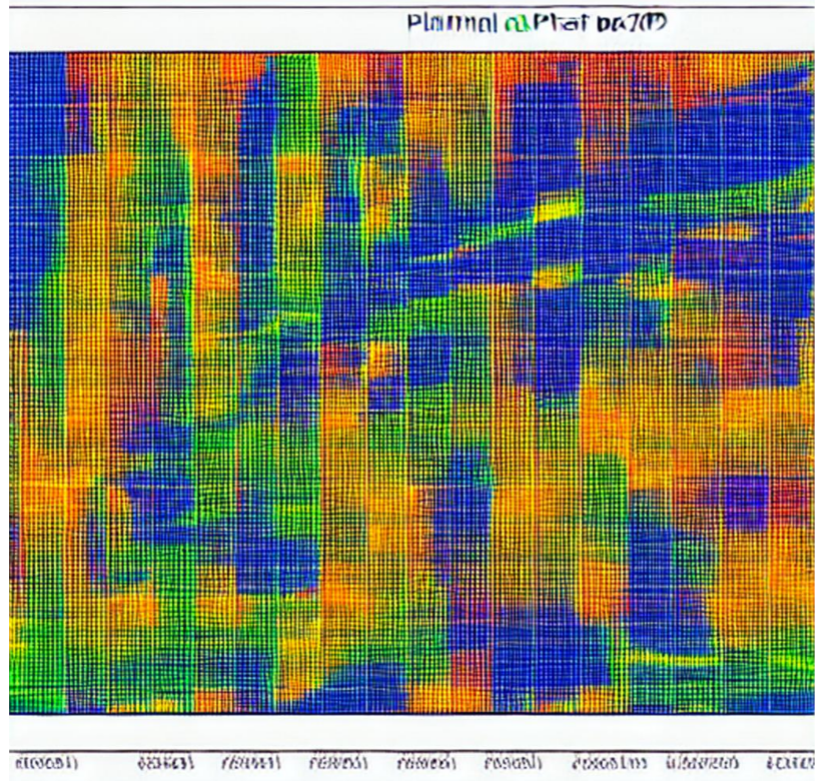

# Фінансовий план грантового проєкту

Безболісне управління грантовим проєктом вимагає чіткого фінансового помісячного планування індивідуальних виплат і витрат за кожною окремою статтею бюджету. Також у якості бонусу створена таблиця опису і дат проєктних подій для розміщення у Гугл Календарі.



*Зображення згенеровано з допомогою веб-сервіса [piscart.com](https://picsart.com/)*

## Зміст

- Призначення застосунку
- Опис вхідних даних
- Опис результатів
- Бонус: Гугл Календар проєктних подій
- Запуск застосунку
- Посилання

## Призначення застосунку

Власне цю роботу виконує цей застосунок. А саме, з календарного плану робіт з розподілом участі виконавців та з врахуванням індивідуальних ставок застосунок розраховує і генерує:

- Загальний сумарний розподіл індивідуальних трудовитрат і виплат
- Щомісячні індивідуальні виплати виконавцям впродовж всього проєкту
- Щомісячні індивідуальні трудові витрати виконавців у люд*днях впродовж всього проєкту
- Щомісячні витрати за окремими основними статтями бюджету впродовж всього проєкту
- У якості бонусу створена таблиця дат подій для розміщення у Гугл Календарі 

## Опис вхідних даних

Вхідні дані формуються у вигляді Ексель-файлу і описані на прикладі уявного проєкту. Приклад файлу вхідних даних `Task schedule (template).xlsx` розташований у субфолдері `./data/`.

 Файл вхідних даних містить п'ять таблиць (аркушів):

- `Task schedule` - календарний план завдань з розподілом участі виконавців
- `Task types` - тип завдань за характером нарахування витрат: пропорційне (`prop`) і готівка (`cache`)
- `Team` - список виконавців із встановленими ставками у проєкті
- `Budget` - постатейний бюджет проєкту
- `Parameters` - важливі параметри проєкту

### `Task schedule` - календарний план

Таблиця календарного плану складається з таких груп полів:

**Група індексації** включає такі колонки:

- `Tsk idx` - внутрішній індекс завдання, 
- `WP` - робочий пакет, до якого відноситься завдання, 
- `Cat` - категорія завдання (див. таблицю `Task types`), 
- `Level` - рівень завдання в ієрархії, 
- `Task/Deliv #` - номер завдання в проєкті

Значення у стовпчику `Cat` вводяться через спадний список (що прив'язаний до однойменного стовпчика з таблиці `Task types`) для уникнення введення помилкових значень. Також уважно слідкуйте відповідності значень у стовпчику `Cat` типу завдання, що вводите (`prop` або `cache`).

**Група (часового) графіку** робіт:

- `DateStart` - дата початку завдання
- `DateEnd` -  дата завершення завдання
- `Duration` - кількість роб днів (тут закладена формула в таблиці, отже нічого поправляти не потрібно, тим більше, що застосунок не бере це поле до уваги і обчислює кількість робочих днів самостійно)

> :warning: Під час введення нових завдань залишайте (або копіюйте) формулу в стовпчику `Duration`. Це важливо для контролю правильності введених дат, а також уникнення помилок (дати можуть бути введені з помилкою і застосунок обов'язково спотикнеться об них). 

**Стовпчик `Cache`** зазначає конкретну суму коштів на виконання завдання (типу `cache`)  (див. таблицю `Task types`).

**Група індивідуальних внесків** складається зі стовпчиків з короткими іменами (`Nick`) виконавців. Кожному з виконавців конкретного  завдання призначається участь у виконанні цього завдання у відносних величинах від 0 до 100, що означає пропорційну частку робочих днів (колонка `Duration`) на це завдання, яку витрачає цей виконавець. 

> :warning: Застосунок враховує всю сукупність внесків від всіх виконавців для всіх завдань і перенормовує їх таким чином, щоб сума нарахувань на оплату праці складала в точності статті бюджету `Personnel costs` (див. таблицю `Budget`)

> :information_source: В цій групі кількість колонок користувачів можна зменшувати / збільшувати за умови 1) короткі імена користувачів і їхня кількість точно збігаються з їхніми іменами зі стовпчика `Nick` в таблиці `Team`, 2) короткі імена мають бути унікальними між собою, а також з назвами інших стовпчиків всіх інших таблиць файлу вхідних даних.

**Стовпчик `Description of task`** містить назву завдання. 

### `Task types` - тип завдань

Ця таблиця містить формалізований опис типів завдань за характером нарахування витрат: пропорційне (`prop`) і готівка (`cache`). Значення зі стовпчика `Cat` ви використовуєте у для позначення типу завдання у календарному плані (`Task schedule`) у відповідному полі `Cat`. 

Ви можете експериментувати і вводити нові унікальні типи завдань з єдиною умовою - у колонці `Type` можна вписувати лише одне з двох значень:  `prop` або `cache`.

### `Team` - список виконавців

Список виконавців не потребує багато пояснень. Всі поля самоочевидні. 

Лише деякі коментарі:

- стовпчик `Nick` використовується також у таблиці `Task schedule`, отже потрібна повна відповідність цих імен там і тут;
- серед ставок за годину, за роб. день і за місяць основою є перша – решта пов'язані простими формулами; окрім того, краще не базуватись на місячну ставку через відмінність кількості роб. днів у кожному місяці; натомість варто будувати власні розрахунки на погодинній або денній ставці;
- у таблиці можна збільшувати  зменшувати кількість рядків.

### `Budget` - бюджет проєкту

В таблиці бюджету фіксовано використовується `Personnel costs` і його значення. Таблиця важлива ще збалансування ваших планових витрат, тобто фінансові щомісячні (щоквартальні, щорічні) показники витрат сумарно мають збігтися з повним бюджетом. Але це ваша ручна робота. І це правильно - не довіряйте будь-кому (або будь-чому) розподіляти ваші кошти за вас, інакше вас немає.

### `Parameters` - важливі параметри проєкту

Таблиця важливих параметрів проєкту не потребує пояснень, наприклад:

- `Working hour / day` – 8
- `Working day / month` – 22
- `Start date` – 01.01.2023
- `End date` – 01.01.2027
- `Overhead` – 25%

В таблиці можна правити лише значення у правій колонці `Value`.

## Опис результатів

Результат роботи застосунку зберігається у новому Ексель-файлі, в імені якого до імені вхідного файлу додається суфікс `_finplan`. Тобто вихідний файл розташований біля вхідного, де б останній не був. В якості тестового прикладу у субфолдері `./data/` репозитарію є приклад файлу вхідних даних `Task schedule (template).xlsx` і поруч з ним фінплан, згенерований цим застосунком, `Task schedule (template)_finplan.xlsx`.

Вихідний файл містить чотири таблиці:

- `Personal contribution` – загальний сумарний розподіл індивідуальних трудовитрат і виплат;
- `Monthly pers payment, Euro` – щомісячні індивідуальні виплати виконавцям впродовж всього проєкту;
- `Tabel, pers-day` – щомісячні індивідуальні трудові витрати виконавців у люд*днях впродовж всього проєкту;
- `All monthly payments` – щомісячні витрати за окремими основними статтями бюджету впродовж всього проєкту;
- `Google calendar` - календар початку і завершення завдань для імпорту до Гугл Календаря.

> :information_source: Документ згенерований застосунком і, тому, охайно не сформатований. Отже треба це зробити власноруч. Особливо потрібно згрупувати стовпчики по кварталах і роках (в Екселі це робиться з допомогою `Дані / Групувати`) - таким чином ви зможете переглядати квартальні та річні зведення. В якості прикладу в субфолдері `./data/` репозитарію розміщений належгим чином сформатований вручну фінансовий план `Task schedule (template)_finplan_formatted.xlsx`.

## Бонус: Гугл Календар проєктних подій

Окремий Гугл Календар проєктних подій дуже корисна штука, особливо якщо цей календар поширити на членів команди. Назва календарної події містить скорочену назву (акронім) проєкту, номер завдання і зазначення, що то є початок або завершення завдання. В описі розміщена повна назва завдання і перелік скорочених імен виконавців.

Для цього спочатку потрібно експортувати таблицю `Google calendar` з результуючого фінплану у вигляді CSV-файлу. Потім цей файл можна експортувати до Гугл Календаря. Ця процедура гарно описана у [відео](https://www.youtube.com/watch?v=Yd1bQ3JDDLY). 

Приклад такого календаря представлений тут же у репозитарії `./data/Task schedule (template)_calendar.csv`.

Після цього має сенс поширити цей календар на членів команди через налаштування на доступ у самому календарі.

## Запуск застосунку

Застосунок розроблений на базі *Python*. Основна програма для запуску застосунку `fin_plan.py`.

Для запуску застосунку необхідно мати встановлений на комп'ютері Python.

Потрібно скачати репозитарій застосунку з *github* і розгорнути його в окремому фолдері.

Запуск здійснюється з командного рядка наступним чином:

```bash
> python fin_plan.py <path/data_file>.xlsx
```

Результат роботи застосунку зберігається у новому Ексель-файлі, в імені якого до імені вхідного файлу додається суфікс `_finplan`:

`<path/data_file>_finplan.xlsx`

> :information_source: Лайф-гак (life-hack) як зручніше запустити застосунок у Віндовс. Відкрийте три наступних вікна:
>
> 1. термінал командного рядка `cmd`;
> 2. файловий провідник з відкритим фолдером застосунку `finplan`;
> 3. файловий провідник з відкритим фолдером, де розташований Ексель-файл вхідних даних проєкту.
>
> У вікні (1) набираєте `python` і пробіл. З вікна (2) застосунку тягнете файл `fin_plan.py` у вікно (1), додаєте пробіл в останньому. Потім тягнете з вікна (3) Ексель-файл вхідних даних до вікна (1). Нарешті натискаєте Enter.Чекаєте безпомилкового завершення виконання застосунку. Дивитесь на результат у вікні (3).   

## Посилання

Код застосунку з прикладом вхідних даних і результатів розташований у [репозитарії github](https://github.com/protw/finplan).

## TODO

- [x] перевірити нормування денних ставок за фіксованого обсягу трудовитрат (люд\*год)
- [x] вставити квартальні і річні підсумки
- [x] оформити CLI інтерфейс застосунку
- [x] підготувати шаблон вхідних даних для викладення у відкритий простір
- [x] підготувати опис та інструкцію
- [x] викласти на github

