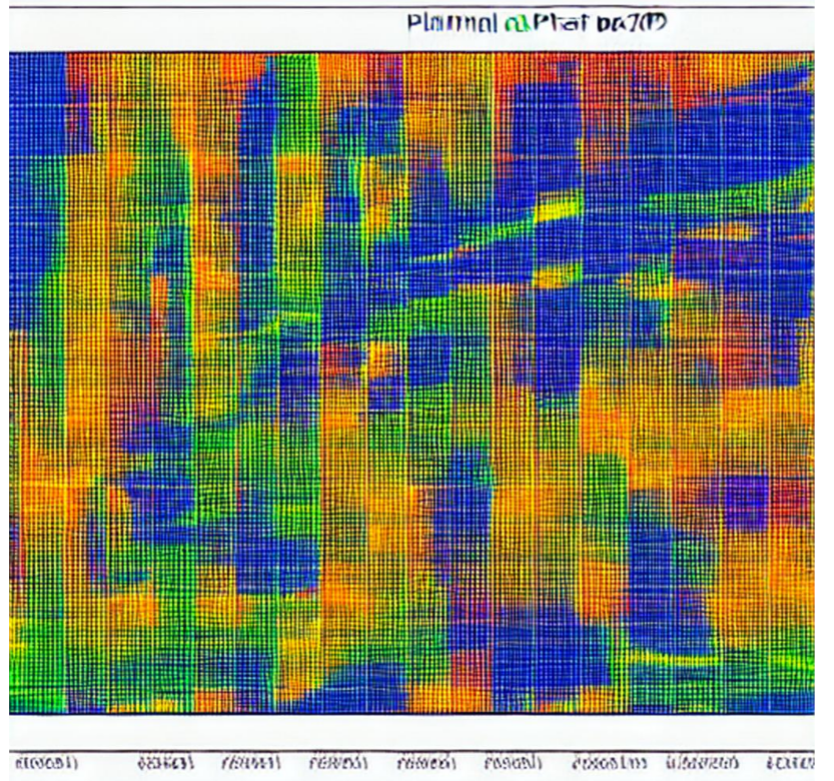

# Financial plan of the grant project

Painless management of the grant project requires clear monthly financial planning of individual payments and expenses for each separate item of the budget.



*Image is generated using* [*piscart.com web service*](https://picsart.com/)

# Content

- Purpose of the application
- Description of input data
  - `Task schedule`- calendar plan
  - `Task types`- type of tasks
  - `Team`- list of performers
  - `Budget`- project budget
  - `Parameters`- important project parameters
- Description of results
- Bonus: Google Calendar of project events
- Launching the application
- Links
  
# Purpose of the application


Actually, this work of creating a financial monthly plan of individual payments and expenses for each separate item of the budget is performed by this application. Namely, from the calendar plan of works with the distribution of participation of performers and taking into account their individual rates, the application calculates and generates:

- General total distribution of individual labor costs and payments
- Monthly individual payments to performers throughout the project
- Monthly individual labor costs of performers in man*days throughout the entire project
- Monthly expenses for individual main budget items throughout the entire project
- As a bonus, the application generates a table of event dates for import into Google Calendar

# Description of input data

The input data is generated in the form of an Excel file and described on the example of an fictitious project. An example input data file `Task schedule (template).xlsx`is located in the subfolder `./data/`.

The input data file contains five tables (sheets):

- `Task schedule`- calendar plan of tasks with distribution of participation of performers
- `Task types`- type of tasks by the nature of costing: proportional ( `prop`) and in-cache ( `cache`)
- `Team`- list of performers with their individual rates in the project
- `Budget`- itemized budget of the project
- `Parameters`- important parameters of the project

## `Task schedule`- calendar plan

The calendar table consists of the following groups of fields:

**The indexing group** includes the following columns:

- `Tsk idx`- the internal index of the task,
- `WP`- the work package to which the task belongs,
- `Cat`- task category (see table `Task types`),
- `Level`- task level in the hierarchy,
- `Task/Deliv #`- task number in the project.

The values in the column `Cat`are entered through the drop-down list (which is tied to the column of the same name from the table `Task types`) to avoid entering erroneous values. It is also necessary to carefully monitor the correspondence of the values in the column of `Cat`the task type that you enter ( `prop`or `cache`).

**The group of columns of the (time) work schedule** includes:

- `DateStart`- task start date
- `DateEnd`- task completion date
- `Duration`- the number of working days (there is a formula in the table, so there is no need to correct anything, especially since the application does not take this field into account and calculates the number of working days on its own)

> ⚠️*When entering new tasks, leave (or copy) the formula in the column `Duration`. This is important for checking the correctness of entered dates, as well as avoiding errors (dates may be entered incorrectly and the application will definitely stumble over them).*

**The column `Cache`** indicates a specific amount of money for the task (type `cache`) (see table `Task types`).

**The group of individual contributions** consists of columns with short names ( `Nick`) of performers. Each of the performers of a specific task is assigned participation in the execution of this task in relative values from 0 to 100, which means a proportional share of working days (from column `Duration`) spent on this task by this performer.

> ⚠️*The application takes into account the entire set of contributions from all performers for all tasks and renormalizes them in such a way that the amount of labor charges exactly equals the budget item `Personnel costs`(see table `Budget`)*
>
> ℹ️ *In this group, the number of performer columns can be reduced / increased under the conditions that: 1) the short names of performer and their number exactly match their names from the column in the table, 2) the short names `Nick` from the table `Team` must be unique among themselves, as well as with the names of other columns in all other input file tables.*

**The column `Description of task`** contains the name of the task.

## `Task types`- type of tasks

This table contains a formalized description of the types of tasks by the nature of costing: proportional ( `prop`) and in-cache ( `cache`). You use the value from the column `Cat`to indicate the type of task in the calendar plan ( `Task schedule`) in the corresponding field `Cat` there.

You can experiment and enter new unique types of tasks with a single condition - you can enter only one of two values in the column : `prop` or `cache`.

## `Team`- list of performers

The list of performers does not need much explanation. All fields are self-explanatory.

Just some comments:

- the column `Nick`is also used in the table `Task schedule`, so full correspondence of these names is required there and here;
- among the individual rates: per hour (`Ставка,  Є/год`), per working day (`Ставка,  Є/день`) and per month (`Ставка,  Є/міс`) – the first one is the basic — the rest are derivatives by simple formulas. Additionally, it is better not to base your calculations on a monthly rate due to the difference in the number of working days in each month. Instead, it is worth building your own calculations on an hourly or daily rate;
- you can increase or decrease the number of rows (performers) in the table.

## `Budget`- project budget

The label `Personnel costs` and its value from the budget table is used by the application, so, the label cannot be changed. The budget table is also important for balancing your planned expenses, that is, the total sum of financial monthly (quarterly, annual) indicators of expenses must coincide with the full budget. But this check is your handiwork. And that's right - don't trust anyone (or anything) to distribute your funds for you, or you're gone.

## `Parameters`- important parameters of the project

The table of important project parameters needs no explanation, for example:

- `Working hour / day`– 8 (*number of working hours per day*)
- `Working day / month`– 22 (*nominal number of working days per month*)
- `Start date`– 01.01.2023 (*project start date*)
- `End date`– 01.01.2027 (*project completion date*)
- `Overhead`– 25% (*percentage of overhead from the sum of all direct costs*)
- `Project acronym `— ZSUV (*project acronym*)

Only the values in the right column `Value` can be edited in the table.

# Description of results

The result of the application is saved in a new Excel file, in the name of which the suffix `_finplan` is added to the name of the input file. That is, the source file is located next to the input file, wherever the latter is. As a test example, in the subfolder `./data/`of the repository there is an example of an input data file `Task schedule (template).xlsx` and next to it a finplan generated by this application `Task schedule (template)_finplan.xlsx`.

> ℹ️ *An example input data file `Task schedule (template).xlsx` can be used as a template.*

The output file contains five tables:

- `Personal contribution` – general total distribution of individual labor costs and payments;
- `Monthly pers payment, Euro` – monthly individual payments to performers throughout the entire project;
- `Tabel, pers-day` – monthly individual labor costs of performers in man*days throughout the entire project;
- `All monthly payments` – monthly expenses for individual main budget items throughout the entire project;
- `Google calendar` - task start and end calendar for import to Google Calendar.

> ℹ️ *The document is generated by the application and, therefore, is not neatly formatted. Therefore, you have to do the formatting yourself. It is especially important to group the columns by quarters and years (in Excel this is done using `Data / Group`) - in this way, you can conveniently view quarterly and annual summaries. As an example, a properly formatted manual financial plan `Task schedule (template)_finplan_formatted.xlsx` is placed in a subfolder `./data/` of the repository.*

# Bonus: Google Calendar of project events

A separate Google Calendar of project events is a very useful thing, especially if this calendar is among the teammates. The name of each calendar event contains the abbreviated name (acronym) of the project, the task number and an indication that it is the beginning or completion of the task. The description contains the full name of the task and a list of abbreviated names of the performers.

Before importing to Google Calendar, you need to export the table `Google calendar`from the resulting finplan as a CSV file. This CSV file can then be imported into Google Calendar. This latter procedure is described in plane language and in detail in [the video](https://www.youtube.com/watch?v=Yd1bQ3JDDLY).

An example of such a calendar, ready for import, is presented right here in the repository `./data/Task schedule (template)_calendar.csv`.

It makes sense to share the imported Google calendar to teammates through access settings in the calendar itself.

# Launching the application

The application that generates all these useful things is developed on the basis of *Python* . The main program for launching the application is `fin_plan.py`.

To run the application, you must have *Python* installed on your computer .

You also need to download the application repository from *github* and deploy it in a separate folder.

The application is launched from the command line as follows:

```
> python <path/>fin_plan.py <path/data_file>.xlsx
```

The result of the application is saved in a new Excel file, in the name of which the suffix `_finplan` is added to the name of the input file:

```
<path/data_file>_finplan.xlsx
```

> ℹ️ *Life-hack how to launch the application in Windows more conveniently.*
>
> *Open the following three windows:*
>
> 1) *command line terminal `cmd`;*
> 2) *a file explorer with an open application folder `finplan`;*
> 3) *a file explorer with an open folder where the Excel file of the input data of your project is located.*
>
> *In the window (1), type `python` and a space. From window (2) of the application folder, drag the file `fin_plan.py` to window (1), add a space in the latter. Then drag the Excel file of input data from the window (3) to the same window (1). Finally, in the window (1) press <Enter>. Wait for the error-free completion of the application. Look at the result in the window (3).*

# Link

The application code with example input data and results is located in [the github repository](https://github.com/protw/finplan).

Keywords: `Finance`, `Project Management`, `Planning`, `Python`